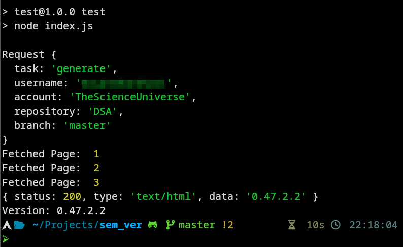

# semver
Semantic Versioning

___

[](https://github.com/TheScienceUniverse/sem_ver)
[](https://github.com/TheScienceUniverse/sem_ver/actions/workflows/node.js.yml)
[](https://github.com/TheScienceUniverse/sem_ver/issues)
[](https://discord.gg/DEYW7vZkm7)


## Overview

- semver is a minimal badge generator that is written and run in server side NodeJS.

## Usage


### Package manager

Using npm:

```bash
$ npm install @sayan_shankhari/sem_ver
```

Using bower:

```bash
$ bower install @sayan_shankhari/sem_ver
```

Using yarn:

```bash
$ yarn add @sayan_shankhari/sem_ver
```

Using pnpm:

```bash
$ pnpm add @sayan_shankhari/sem_ver
```

Once the package is installed, you can import the library using `import` or `require` approach:

```js
import semver from "@sayan_shankhari/sem_ver/";
```

If you use `require` for importing, **only default export is available**:

```js
const semver = require ("@sayan_shankhari/sem_ver/");
```

## Example

```js
const semver = require ("@sayan_shankhari/sem_ver");


let req_obj = semver .create_new_request (
	task = "generate"
	/*, username = "YOUR_GITHUB_USERNAME"*/
	, account = "TheScienceUniverse"
	, repository = "sem_ver"
	, branch = "master"
);

console .log (req_obj);

async function test (req_obj) {
	let version = await semver .gen_sem_ver (req_obj);
	console .log ("Version:", version);
}

test (req_obj);
```

> **Note**: `async/await` is part of ECMAScript 2017 and is not supported in Internet
> Explorer and older browsers, so use with caution.


## Showcase

```bash
$ npm test
```


___

## History

- Hi, this is the inititiator of this repo. After searching in npm registri could not find dynamic version badge for markdown, so creating this, feel free to test, use and contribute.

- Please try this tool on systems (computer, mobile, embded systems having nodejs running).
 

## [🤝 Contributing](./CONTRIBUTING.md)

## [📜 Code of Conduct](./CODE_OF_CONDUCT.md)

## [🔒 Security](./SECURITY.md)

## 💝 Support

If you like this DSA Project and would like to support & appreciate it via donation then I'll gladly accept it. 

[](https://ko-fi.com/sayan_shankhari)
[](https://www.buymeacoffee.com/sayan.shankhari)

[]()
[](https://www.paypal.com/paypalme/the01guy)
[]()
[]()
[]()
[]()
